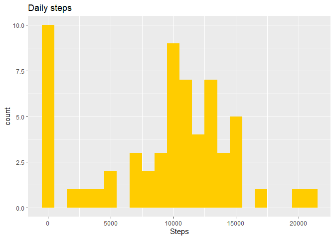
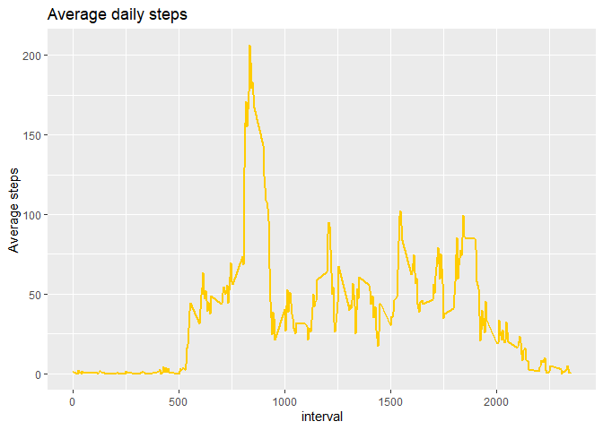
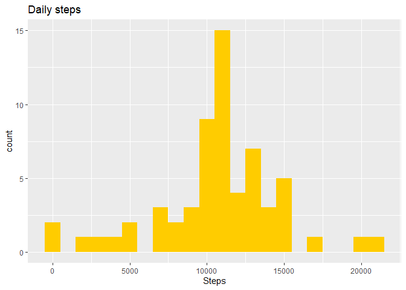
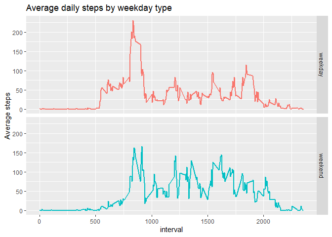

## Loading and preprocessing the data

Unziping and reading the data

```r
unzip("activity.zip")
data <- read.csv("activity.csv")
```


## What is mean total number of steps taken per day?

1. Calculate the total number of steps taken per day

```r
library(dplyr)
```

```
## 
## Attaching package: 'dplyr'
```

```
## The following objects are masked from 'package:stats':
## 
##     filter, lag
```

```
## The following objects are masked from 'package:base':
## 
##     intersect, setdiff, setequal, union
```

```r
TotalSteps <- data %>% group_by(date) %>% summarise(stepsT = sum(steps, na.rm = TRUE))

head(TotalSteps)
```

```
## # A tibble: 6 x 2
##   date       stepsT
##   <fct>       <int>
## 1 2012-10-01      0
## 2 2012-10-02    126
## 3 2012-10-03  11352
## 4 2012-10-04  12116
## 5 2012-10-05  13294
## 6 2012-10-06  15420
```

2. If you do not understand the difference between a histogram and a barplot, research the difference between them. Make a histogram of the total number of steps taken each day

```r
library(ggplot2)
ggplot(TotalSteps, aes(x = stepsT)) + geom_histogram(fill = "#FFCC00", binwidth = 1000) + labs(title = "Daily steps", x = "Steps", "Frequency")
```

<!-- -->

3. Calculate and report the mean and median of the total number of steps taken per day

```r
TotalSteps %>% summarise(mean = mean(stepsT), median = median(stepsT))
```

```
## # A tibble: 1 x 2
##    mean median
##   <dbl>  <int>
## 1 9354.  10395
```

## What is the average daily activity pattern?

1. Make a time series plot (i.e. type = "l"\color{red}{\verb|type = "l"|}type = "l") of the 5-minute interval (x-axis) and the average number of steps taken, averaged across all days (y-axis)

```r
MeanInterval <- data %>% group_by(interval) %>% summarise(meanI = mean(steps, na.rm = TRUE))

ggplot(MeanInterval, aes(x = interval, y = meanI)) + geom_line(color = "#FFCC00", size=1) + labs(title = "Average daily steps", y = "Average steps")
```

<!-- -->

2. Which 5-minute interval, on average across all the days in the dataset, contains the maximum number of steps?

```r
MeanInterval %>% filter(meanI == max(meanI)) %>% select(interval)
```

```
## # A tibble: 1 x 1
##   interval
##      <int>
## 1      835
```

## Imputing missing values

1. Calculate and report the total number of missing values in the dataset (i.e. the total number of rows with NA\color{red}{\verb|NA|}NAs)

```r
nrow(data[is.na(data$steps),])
```

```
## [1] 2304
```

2. Devise a strategy for filling in all of the missing values in the dataset. The strategy does not need to be sophisticated. For example, you could use the mean/median for that day, or the mean for that 5-minute interval, etc.

```r
# We will fill the missing values with the mean of 5-minute interval

data <- data %>% group_by(interval) %>% mutate(steps = replace(steps, is.na(steps), mean(steps, na.rm=TRUE)))
```

3. Create a new dataset that is equal to the original dataset but with the missing data filled in.

```r
write.csv(data, file = "tidyData.csv")
```

4. Make a histogram of the total number of steps taken each day and Calculate and report the mean and median total number of steps taken per day. Do these values differ from the estimates from the first part of the assignment? What is the impact of imputing missing data on the estimates of the total daily number of steps?

```r
TotalSteps <- data %>% group_by(date) %>% summarise(stepsT = sum(steps, na.rm = TRUE))

TotalSteps %>% summarise(mean = mean(stepsT), median = median(stepsT))
```

```
## # A tibble: 1 x 2
##     mean median
##    <dbl>  <dbl>
## 1 10766. 10766.
```

```r
ggplot(TotalSteps, aes(x = stepsT)) + geom_histogram(fill = "#FFCC00", binwidth = 1000) + labs(title = "Daily steps", x = "Steps", "Frequency")
```

<!-- -->

with NA's in a data set, our mean = 9354.23 and median = 10395  
after filling NA's with mean of each interval, mean = 10766.19 and median = 10766.19

## Are there differences in activity patterns between weekdays and weekends?

1. Create a new factor variable in the dataset with two levels – “weekday” and “weekend” indicating whether a given date is a weekday or weekend day.

```r
data <- data %>% mutate(date = as.POSIXct(date, format = "%Y-%m-%d"))

data <- data %>% mutate(WeekdayOrWeekend = as.factor(if_else(weekdays(date) %in% c("šeštadienis", "sekmadienis"), "weekend", "weekday")))
```

2. Make a panel plot containing a time series plot (i.e. type = "l"\color{red}{\verb|type = "l"|}type = "l") of the 5-minute interval (x-axis) and the average number of steps taken, averaged across all weekday days or weekend days (y-axis). See the README file in the GitHub repository to see an example of what this plot should look like using simulated data.

```r
MeanInterval <- data %>% group_by(interval, WeekdayOrWeekend) %>% summarise(meanI = mean(steps, na.rm = TRUE))

ggplot(MeanInterval, aes(x = interval, y = meanI, color = WeekdayOrWeekend)) + geom_line(size = 1) + facet_grid(WeekdayOrWeekend~.) + theme(legend.position = "none") + labs(title = "Average daily steps by weekday type", y = "Average steps")
```

<!-- -->
